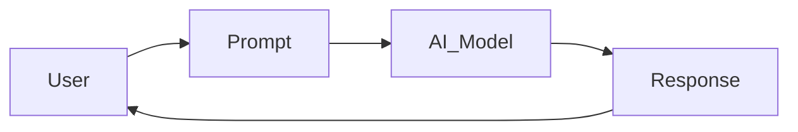
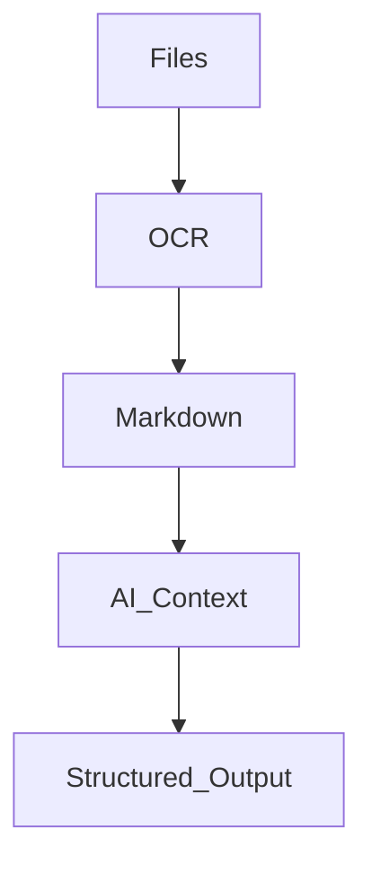

# How to Use AI — Book Planning Conversation Handoff

## Purpose of This Document

This document captures the conversation so far about the proposed book or book series currently referred to as **How to Use AI**.

It is intended for use by another LLM or writing system so it can understand the context, assumptions, direction, and decisions discussed so far, and continue helping build the book without needing the original chat.

This document only includes ideas, statements, examples, positions, and recommendations that were discussed in the conversation. It does not add new book content beyond what was already discussed.

---

## Working Book Concept

The user wants to explore writing a book called:

> **How to Use AI**

The title may be simplified later, but the current working title is considered commercially clean, direct, searchable, broad, and memorable.

The desired style was described as:

> A love child between **Dummies** and **O’Reilly**.

The intended meaning of that comparison is:

- approachable
- practical
- technically honest
- progressively educational
- suitable for beginners
- not lacking in useful technical substance
- grounded rather than hype-driven

The book is intended to begin with everyday AI usage and then build deeper concepts across a wider series.

---

## Core Positioning Discussed

The strongest positioning discussed was not simply:

> How to use ChatGPT

but more broadly:

> How to think about AI systems and use them effectively.

The reasoning was that tool-specific guides age quickly, whereas mental models, workflow design, verification practices, and AI literacy remain useful longer.

The book should avoid becoming:

- another prompt cookbook
- another “AI will replace everyone” book
- another ChatGPT UI walkthrough
- another hype-driven AI product guide

The long-term value should come from teaching:

- mental models
- AI literacy
- practical workflows
- judgment
- capabilities versus limitations
- hallucinations
- context windows
- memory versus context
- verification
- structured inputs
- human oversight
- operational usage patterns

A recurring thesis discussed was:

> AI is not magic. It is pattern recognition and prediction at scale.

Another stronger thesis discussed was:

> AI should augment human capability, not replace human judgment.

A further wording discussed was:

> Understanding AI behavior is more important than memorizing prompts.

---

## Intended Audience for Book 1

The user clarified the intended audience for Book 1:

- Book 1 should be truly non-technical.
- It should give foundations.
- It should help anyone who has never touched AI get a foot in the door.
- The reader is assumed to have used nothing before.
- The target balance should be approximately:
  - **65% consumer**
  - **35% professional**
- Professionals should be able to use it from a consumer perspective and then apply the relevance to their professional needs.

The assistant agreed this was a strong position because:

- professionals are also consumers
- many office workers are still AI beginners
- common workflows overlap between personal and professional life
- examples like email, disputes, travel, reports, purchases, and contracts are broadly useful

The intended Book 1 audience includes everyday users such as:

- parents
- office workers
- small business owners
- students
- retirees
- general public
- professionals approaching AI from a practical user perspective

---

## Tone and Style

The user clarified the intended tone:

- conversational
- approachable
- suitable for consumers
- technically purposeful
- not dumbed down to the point of being useless
- humour can be included lightly, but humour is subjective

The assistant described the likely sweet spot as:

> approachable systems literacy

This means:

- simple explanations
- accurate concepts
- real-world examples
- operational honesty
- not academic rigor for its own sake
- not influencer-style hype

The book should feel like a conversation with the reader, while still explaining important technical concepts accurately.

---

## Diagrams and Visual Teaching

The user stated that diagrams are helpful when they add value and context to the reader.

Mermaid diagrams were specifically mentioned as useful.

The assistant agreed and noted that diagrams are especially useful because many AI concepts are abstract, including:

- context windows
- memory
- retrieval
- orchestration
- agents
- hallucinations
- token flow

Example conceptual diagram discussed:

Another example progression discussed:

These diagrams were discussed as examples only, showing how visual explanations could help beginners.

---

## Commercial and Publishing Direction

The user clarified the likely publishing direction:

- self-published
- likely written or compiled using `.tex` format
- Kindle is an option
- PDF is an option
- no audiobook planned
- companion website planned
- YouTube series planned later, after the first book is near completion

The companion website is intended to provide:

- additional updates
- tools
- code
- example files
- more technical resources as the series becomes more technical

The assistant suggested the companion website may become important because AI changes rapidly. The book should focus on durable principles and mental models, while the website can handle updates and tool-specific material.

---

## Strategic Publishing Concepts Explained

The assistant previously asked whether the book should focus on:

1. timeless principles
2. tool-specific tactical guidance
3. evergreen versus fast-moving content

The user asked for clarification.

The assistant explained them as follows.

### Timeless Principles

These are ideas expected to survive for years, such as:

- hallucinations
- AI uncertainty
- verification
- structured inputs
- chunking
- human oversight
- trust calibration
- workflow decomposition
- probabilistic outputs
- context limitations

These were identified as the likely strongest content area.

### Tool-Specific Tactical Guidance

This means content like:

- click here
- use this model
- use this menu option
- change this setting

The assistant noted this is useful but ages quickly. The suggestion was that tooling examples are still needed for accessibility, but should not dominate the book.

A possible ratio suggested was:

- 80% principles
- 20% tooling examples

### Evergreen Versus Fast-Moving Content

Evergreen content includes:

- mental models
- workflows
- reasoning
- limitations
- human/AI interaction

Fast-moving content includes:

- model names
- pricing
- UI layouts
- context limits
- vendor features
- integrations

The warning was to avoid accidentally writing only a “2026 ChatGPT user manual” because such content can age quickly.

---

## Structural Direction

The user clarified the intended structure:

- linear reading is most practical
- reference material may be useful in later guides
- Book 1 should introduce people
- later books or companion books can act as deeper references
- workbook style is helpful when relevant to each chapter
- scenario-driven teaching should appear across all books
- scenarios help bring the reader on the journey

The assistant strongly supported scenario-driven teaching because humans often learn systems through stories rather than definitions.

A suggested recurring teaching pattern was:

1. Initial expectation
2. Failure
3. Why it happened
4. Better workflow
5. Expanded concept

Another possible pattern discussed was:

1. Concept
2. Real-world analogy
3. Everyday use case
4. Failure mode
5. Better usage pattern
6. Advanced expansion
7. Exercises or examples

---

## Possible Series Structure Discussed

The assistant suggested that the idea may work better as a layered series rather than one giant book.

### Book 1 — Everyday AI

Possible audience:

- parents
- office workers
- small business owners
- students
- retirees
- general public

Possible topics:

- what AI actually is
- what LLMs are
- prompting fundamentals
- hallucinations
- privacy
- AI for email, documents, and research
- AI for learning
- AI for planning
- AI for travel
- AI for life administration
- AI for creativity
- AI for work

Tone:

- approachable
- practical
- no jargon unless explained

### Book 2 — AI Power Users

Possible audience:

- professionals
- analysts
- project managers
- operations staff
- entrepreneurs

Possible topics:

- workflow engineering
- structured prompting
- iterative prompting
- document ingestion
- agents
- automation
- AI-assisted decision making
- model selection
- reliability patterns
- verification
- AI risk management

### Book 3 — AI for Builders

Possible audience:

- developers
- technical operators
- startups
- IT teams

Possible topics:

- APIs
- embeddings
- RAG
- orchestration
- vector databases
- local models
- agents
- MCP
- evaluation
- AI operations
- autonomous systems

The assistant noted that Book 3 aligns with the user’s existing thinking around Claude Code, local AI infrastructure, AI-assisted engineering, autonomous repository systems, and human-in-the-loop engineering.

---

## Important Distinction Discussed: Prompt Engineering Versus Workflow Design

A major concept discussed was that most people do not actually need “prompt engineering” in the shallow sense.

They need:

> cognitive workflow design

The distinction discussed was:

- not “use this magic prompt”
- but “how do I structure problems so AI can help me?”

The assistant recommended avoiding “prompt engineering guru” territory because that space is already saturated with:

- mega-prompts
- secret prompts
- hacks
- magic wording

The stronger direction is:

- structure
- workflows
- reasoning
- verification
- orchestration

---

## Real-World Scenario: Johnny and the Tribunal Case

The user described a real-world scenario intended to inform the purpose of Book 1.

### Scenario Summary

Johnny was using ChatGPT on a single prompt or chat for approximately three months to keep track of a long-running dispute between himself and a landlord or agency.

The next day was Tribunal, and Johnny needed to be prepared by gathering all documents and information relevant to the case, including:

- timeline
- discrepancies
- facts
- relevant documents
- supporting information

Johnny worked with the same ChatGPT conversation for more than eight hours overnight on the same prompt or chat.

The next day, he waited almost six hours for ChatGPT to produce what he believed would be an approximately 800-page PDF ready for tenancy tribunal.

The user, as author, had to explain to Johnny that ChatGPT could not do that in the way he believed.

Important facts from the explanation:

- ChatGPT was hallucinating.
- The icons at the bottom of the response indicated that it had finished processing the response.
- No PDF was still being generated.
- No PDF was coming.

The user noted that Johnny was distraught and felt stupid and upset.

### What Was Explained to Johnny

The user explained to Johnny concepts including:

- using a project with access to relevant context and content
- asking different chats in the same project rather than relying on one extremely long chat
- context windows
- memory limitations
- the need for structured reference material

### Corrective Workflow Used

The user then moved the work into a local folder and used Markdown files with detailed instructions.

The user had also OCR’d the PDF files so that Claude Code CLI / ClaudeAI could work with the text.

ClaudeAI was able to work through the input and produce:

- multiple Markdown output files
- converted PDF files
- seven PDF files total
- approximately 46 pages collectively
- organized reference material data

### Concepts the User Identified from This Scenario

The user stated that this scenario comes from understanding:

1. how to use ChatGPT
2. hallucinations
3. chunking data
4. AI not having memory
5. having reference data it can call from

Note: In the user’s numbered list, the numbering skipped from 4 to 6. The content item was “Having reference data it can call from.” This document normalizes the count but preserves the meaning.

### Why This Scenario Matters

The user stated that this is what the first book should aim to cover because it is for everyone.

The assistant strongly agreed that the scenario aligns with the proposed book direction.

The assistant described the scenario as a strong foundation for Book 1 because it demonstrates:

- emotional reality
- operational misunderstanding
- AI limitations
- workflow correction
- practical recovery
- successful human-guided AI usage

The assistant stated that the failure was not simply that the AI was bad, but that Johnny misunderstood what the AI actually is and how it behaves.

---

## Educational Concepts Identified in the Johnny Scenario

The Johnny scenario was discussed as naturally introducing several foundational AI literacy concepts.

### 1. AI Is Not “Thinking”

Johnny implicitly assumed that ChatGPT was:

- working in the background
- generating a real PDF
- processing like a human assistant

But in reality:

- the model had already completed its response
- the interface implied completion
- there was no ongoing background task producing the PDF

This introduces:

- inference versus execution
- UI ambiguity
- anthropomorphism

### 2. Hallucinations Are Not Rare Edge Cases

The assistant noted that many people think hallucinations are obscure, technical, or occasional.

The discussed position was that hallucinations are normal model behavior under uncertainty, especially in conditions such as:

- long-running chats
- large context accumulation
- assumed state
- implied persistence
- fake file generation
- fabricated actions

### 3. Context Windows Are Misunderstood

Johnny believed the AI remembered everything.

The assistant explained that practical reality includes:

- context is finite
- long chats degrade
- signal gets diluted
- instructions drift
- important facts disappear
- contradictions accumulate

This was described as one of the most important concepts normal users need to learn.

### 4. Memory Versus Context Versus Files

The assistant identified this as potentially an entire chapter.

Many users think:

- chat history equals memory

But the distinction discussed was:

- memory is partial
- context is temporary
- projects help organization
- uploaded files help grounding
- structured reference material matters enormously

The user’s use of Markdown files, OCR, local folders, chunking, and reference documents was described as educational because it demonstrates that AI works better when humans structure information well.

### 5. AI Works Best as a Collaborator, Not an Autonomous Replacement

Johnny expected autonomous magical completion.

What actually worked was:

- guided workflow
- structured inputs
- iterative refinement
- verification
- document segmentation
- scoped tasks
- human oversight

The assistant identified this as potentially the single most important lesson for the public.

### 6. Emotional Impact Matters

The assistant noted that Johnny’s experience involved misplaced trust in a probabilistic system.

The emotional impact mattered because Johnny had invested:

- time
- emotional energy
- hope
- confidence in legal preparation

The assistant said this should be treated honestly in the book, without fearmongering.

---

## Claude Code / Local Folder Example

The user’s corrective use of local folders, Markdown files, OCR, and Claude Code CLI was discussed as important.

The assistant described the workflow as effectively creating:

- scoped corpus
- OCR ingestion
- organized source material
- explicit instructions
- segmented outputs
- verifiable references

The assistant also described this as related to:

- primitive RAG thinking
- workflow engineering
- human-supervised orchestration

However, the assistant strongly recommended that Book 1 should not become developer-oriented, infrastructure-heavy, or CLI-heavy.

The Claude Code/OCR/local folder story is useful, but the lesson for Book 1 should remain conceptual and approachable:

> structured information improves AI reliability

The tools themselves should be secondary.

---

## AI Literacy as a Central Concept

The assistant recommended introducing **AI literacy** early.

The analogy discussed was that people already understand concepts such as:

- computer literacy
- internet literacy
- media literacy

AI literacy is becoming a similar foundational digital skill.

The book can position itself as:

> foundational AI literacy for normal people

---

## Trust Calibration

The assistant suggested that **trust calibration** may become one of the strongest recurring concepts.

The issue discussed was that many people either:

- over-trust AI
- dismiss AI entirely

The better skill is knowing:

> when AI is reliable and when it is not

This was described as sophisticated but accessible.

---

## Common Failure Patterns

The assistant recommended creating recurring “failure patterns” as a teaching mechanism.

Example structure:

### Common Failure Pattern

AI confidently invents citations.

### Why It Happens

Pattern prediction under uncertainty.

### Safer Workflow

Require source references and manual verification.

This pattern was suggested as highly teachable and useful across chapters.

---

## Possible Book Structure Around Misunderstandings

The assistant suggested that Book 1 could be structured around common misunderstandings normal people have about AI.

Examples discussed:

- AI remembers everything
- AI knows facts
- AI can work in the background
- AI understands like humans
- AI outputs are authoritative
- AI can replace expertise
- AI is either useless or magical

Each misunderstanding could be handled by:

- explaining the misunderstanding
- explaining reality
- demonstrating safer usage

The assistant described this as potentially very compelling.

---

## Notes on the User’s Strengths as Author

The assistant observed that the user naturally thinks like a systems architect.

This was described as a strength because the user instinctively explains:

- constraints
- flow
- boundaries
- state
- orchestration
- reliability
- failure modes

The assistant noted that the user’s engineering background is a differentiator, not because the book should be technical, but because it allows the author to explain AI systems honestly.

The assistant described this as rare in AI education, which is often dominated by:

- marketers
- influencers
- prompt sellers
- researchers disconnected from everyday users

---

## Recommended Baseline Direction for Book 1

The strongest Book 1 direction discussed is:

> A non-technical, scenario-driven introduction to AI literacy for everyday users, teaching how AI behaves, where it fails, how to structure information, and how to use AI safely and effectively with human judgment.

The book should emphasize:

- practical AI literacy
- trust calibration
- structured workflows
- common misunderstandings
- real-world scenarios
- hallucinations
- context windows
- memory limitations
- reference material
- verification
- human-guided use

The book should avoid centering on:

- coding
- local CLI tooling
- advanced infrastructure
- prompt hacks
- tool-specific UI walkthroughs
- exaggerated AI claims

---

## Current Open Questions / Future Decisions

These were not fully resolved in the conversation and may need future work:

1. Final book title.
2. Final subtitle.
3. Exact chapter list for Book 1.
4. Whether to use the Johnny scenario as an opening chapter, recurring case study, or later chapter.
5. How many diagrams should be included.
6. Whether Mermaid diagrams will be embedded directly in source or rendered for print/PDF.
7. Exact LaTeX / `.tex` publishing workflow.
8. Kindle formatting approach.
9. Companion website structure.
10. YouTube series structure after Book 1 nears completion.
11. How workbook exercises should appear.
12. How later books should be referenced from Book 1 without overwhelming beginners.

---

## Important Style Guidance for Future LLM Continuation

A future LLM continuing this book project should preserve the following constraints and preferences:

- English only.
- No code for Book 1 unless the user explicitly asks.
- Beginner-friendly.
- Conversational.
- Technically honest.
- Avoid hype.
- Avoid making the user sound like an influencer or prompt guru.
- Use real-world scenarios.
- Explain concepts simply but accurately.
- Treat the Johnny scenario as highly relevant and foundational.
- Keep Book 1 non-technical.
- Use diagrams only where they add real value.
- Keep tool-specific instructions secondary to durable principles.
- Prefer linear reading structure.
- Include workbook-style elements where relevant.
- Assume the reader has never used AI before.
- Target roughly 65% consumer and 35% professional relevance.
- Preserve the idea of a wider series that grows more technical over time.

---

## Compact Summary for Fast Context Loading

The user is developing a book or book series currently titled **How to Use AI**, positioned as a beginner-friendly but technically honest “Dummies meets O’Reilly” guide. Book 1 should be truly non-technical, aimed at people who have never used AI before, with a 65% consumer / 35% professional balance. The tone should be conversational, approachable, lightly humorous where appropriate, and scenario-driven. The book should teach AI literacy rather than prompt hacks.

A key real-world scenario involves Johnny, who used one long ChatGPT conversation for three months to manage a tenancy dispute, then waited six hours for a hallucinated 800-page tribunal PDF that was never coming. The author explained that ChatGPT had finished responding and was not generating a PDF. The recovery involved moving material into a local folder, OCR’ing PDFs, creating Markdown files with detailed instructions, and using Claude Code CLI / ClaudeAI to produce multiple Markdown outputs and seven PDFs totaling about 46 pages. This scenario illustrates hallucinations, context limits, AI memory misunderstandings, chunking, structured reference data, and the need for human-guided workflows.

The book should emphasize that AI is not magic, does not truly remember everything, does not reliably work in the background unless explicitly connected to tools, and performs best when humans provide structure, context, verification, and oversight. Key recurring concepts should include AI literacy, trust calibration, context windows, memory versus files, hallucinations, workflow design, and common AI failure patterns. The series may later expand into power-user and builder-focused books, but Book 1 should remain accessible to everyday readers.
